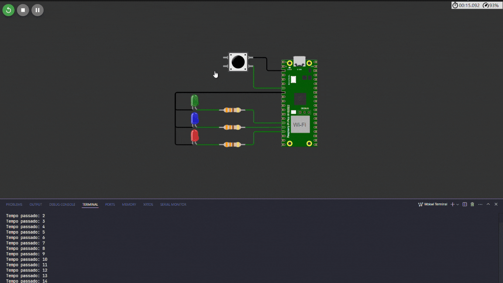

# Atividade de Clock e Temporizadores

Este repositório contém o código-fonte e os arquivos relacionados à atividades de clock e temporizadores, desenvolvido como parte de uma atividade prática no curso de Sistemas Embarcados.

## Execução dos Programas

### Atividade 1

### Atividade 2

## Descrição dos Programas

O projeto da atividade 1 consiste na simulação de um semáforo, onde os LEDs representam os estados do semáforo. O programa utiliza um temporizador para chamar uma função a cada 3 segundo, que alterna entre os estados verde, amarelo e vermelho.

O projeto da atividade 2 consiste na criação de um sistema de temporização para acionamento dos leds usando uma pushbutton. Quando o botão é pressionado, o temporizador é acionado e os leds são acionados e acada 3 segundos um dos leds é desligado. Enquanto todos os não estiverem desligados, o botão não pode acionar o temporizador novamente.

## Requisitos

Antes de começar, certifique-se de ter as ferramentas abaixo instaladas no seu ambiente de desenvolvimento:

- [Visual Studio Code](https://code.visualstudio.com/)
- Extensão para Raspberry Pi Pico no Visual Studio Code
- [Wokwi](https://wokwi.com/) para simulação online
- [PICO-SDK](https://github.com/raspberrypi/pico-sdk) configurado no seu ambiente

## Circuito Simulado

O circuito utilizado na simulação é composto pelos seguintes componentes:
- **3 LEDs** conectados aos GPIO 11, 12 e 13.
- **1 Pushbutton** conectado ao GPIO 05.
- Ambos os componentes estão conectados ao GND.
- Placa Raspberry Pi Pico W

## Como Compilar e Executar

1. Configure o **PICO-SDK** no seu ambiente de desenvolvimento usando a extensão Raspberry Pi Pico no Visual Studio Code.
2. Escolha uma das atividades (atividade 1 ou atividade 2) e abra o arquivo correspondente no Visual Studio Code.
3. Compile o firmware usando o botão de compilação no Visual Studio Code.
4. Conecte a placa BitDogLab ao computador no modo BOOTSEL.
5. Clique no botão denominado "run" no Visual Studio Code para carregar o firmware na placa.
6. A placa executará automaticamente o firmware.

## Autor

Leonardo Ferreira Lima  
Email: ferreiiratech@gmail.com  